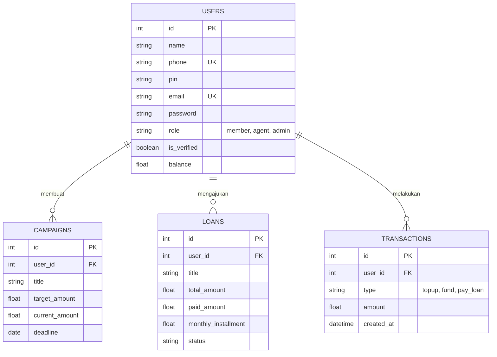

<div align="center">
  <h1>🌱 Umoja</h1>
  <p><b>Platform Inklusi Keuangan Komunal (O2O)</b></p>
  
  
  
</div>

<br>

**Umoja** (berasal dari kata Swahili yang berarti "Kesatuan" atau "Gotong Royong") adalah sebuah sistem informasi berbasis *Online-to-Offline* (O2O) yang dirancang untuk mendigitalkan ekosistem keuangan komunitas. Sistem ini menjembatani pencatatan digital yang transparan dengan kehadiran fisik melalui Agen Lokal, difokuskan pada area dengan literasi perbankan konvensional yang masih berkembang (seperti pedesaan atau koperasi lokal).

Dengan sistem ini, perputaran likuiditas komunitas dapat dilacak secara akurat, mencegah penggelapan dana, dan mendorong kemandirian ekonomi tingkat akar rumput.

---

## ✨ Fitur Utama

- **Urun Dana (Crowdfunding):** Menggalang dana untuk kebutuhan mendesak dan didanai secara kolektif.
- **Pinjaman Mikro Komunitas:** Pengajuan kredit usaha mikro dengan sistem persetujuan komunitas.
- **Tabungan Kelompok (Digital Kas):** Otomatisasi pembayaran iuran rutin (arisan/kas desa).
- **KYC Fisik (Agen Lokal):** Validasi identitas pengguna yang dijamin oleh kehadiran manusia (Agen).
- **Dompet Digital (Wallet):** Penyimpanan saldo virtual untuk transaksi instan antar anggota.

---

## 🛠️ Teknologi yang Digunakan

### Front-End


### Back-End & Database


---

## 👥 Peran dan Hak Akses (Roles)

Sistem ini menggunakan arsitektur *Role-Based Access Control* (RBAC) dengan satu pintu otentikasi.

| Peran | Kredensial Masuk | Deskripsi & Hak Akses |
| :--- | :--- | :--- |
| **Member (Warga)** | Nomor HP + PIN | Konsumen utama. Mendaftar secara mandiri. Mengakses fitur urun dana, pinjaman, dan dompet. Membutuhkan verifikasi fisik sebelum bertransaksi penuh. |
| **Agent (Agen Lokal)**| Nomor HP + PIN | Perpanjangan tangan sistem di lapangan. Bertugas melakukan verifikasi fisik (mencocokkan KTP dengan wajah) dari warga baru. |
| **Super Admin** | Email + Password | Pusat kendali sistem. Memantau dasbor analitik agregat (total likuiditas, jumlah pengguna aktif) dan mengelola akun agen. |

---

## 🔄 Alur Penggunaan (User Flow)

1. **Registrasi:** Warga mendaftar menggunakan Nama, Nomor Telepon, dan PIN 4-digit. Akun berstatus *Unverified*.
2. **KYC Fisik:** Warga mendatangi Agen Lokal terdekat dengan membawa KTP. Agen melakukan verifikasi melalui dasbor.
3. **Top-Up Saldo:** Warga menyetorkan uang tunai kepada Agen, saldo digital warga bertambah.
4. **Transaksi:** Warga terverifikasi dapat menyalurkan dana ke kampanye, mengajukan pinjaman, atau membayar iuran.

---

## 📊 Entity Relationship Diagram (ERD)



---

## 🚀 Panduan Instalasi (Development)

**Prasyarat:** Pastikan Anda telah memasang **Go (1.20+)**, **Node.js (18+)**, dan **MySQL**.

### 1. Pengaturan Database
Buat database baru di MySQL lokal Anda:
```sql
CREATE DATABASE umoja_db;
```

### 2. Pengaturan Back-End (Go)
```bash
# Pindah ke direktori backend
cd backend

# Salin konfigurasi environment
cp .env.example .env
# Edit .env dan masukkan JWT_SECRET serta kredensial database Anda

# Unduh dependensi
go mod tidy

# Jalankan peladen (Seeder Super Admin akan berjalan otomatis)
go run main.go
```
> 📍 Peladen Go akan berjalan di `http://localhost:8080`

### 3. Pengaturan Front-End (Vue)
```bash
# Pindah ke direktori frontend
cd frontend

# Unduh dependensi NPM
npm install

# Jalankan server pengembangan Vite
npm run dev
```
> 📍 Aplikasi Vue akan berjalan di `http://localhost:5173`

---

## 🔐 Kredensial Bawaan (Default Seeder)

Saat backend pertama kali dijalankan, sistem akan otomatis membuat satu akun Super Admin. Anda dapat masuk melalui portal `/admin/login`.

- **Email:** `admin@umoja.id`
- **Password:** `AdminUmoja2026!`

*(Catatan: Segera ubah kredensial ini di lingkungan produksi atau bersihkan riwayat commit jika `.env` tidak sengaja terunggah).*
